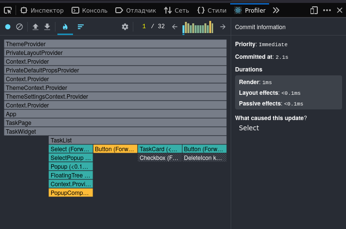
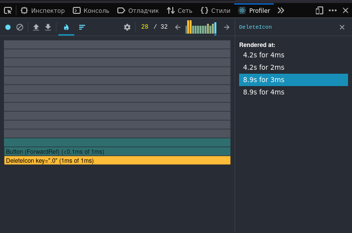
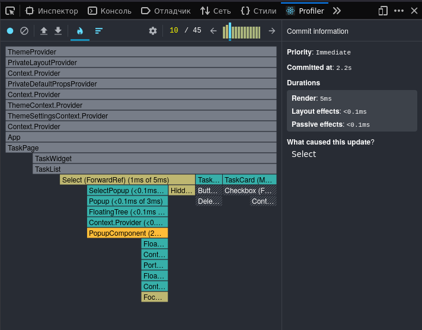
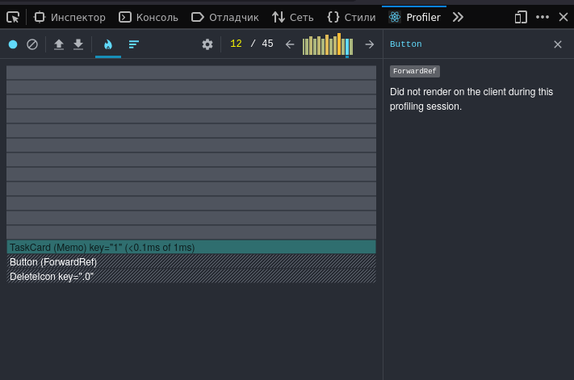
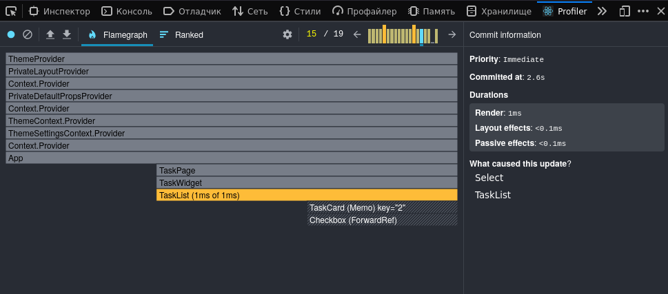
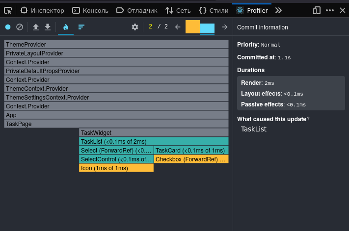
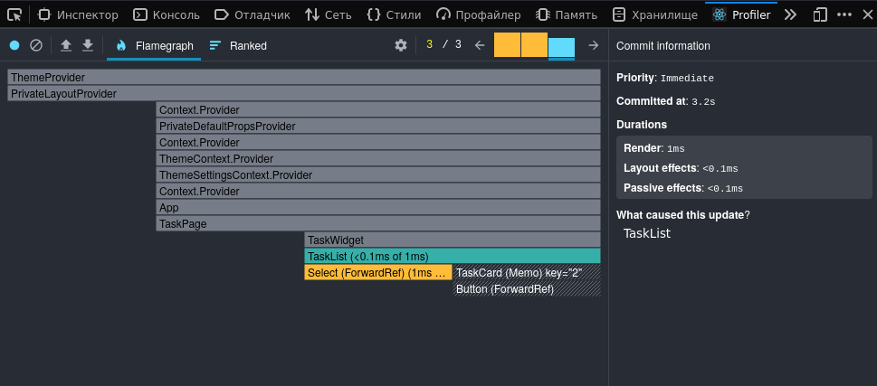

# Filtering
before

after

До оптимизации иконка удаления рендерилась многократно, после мемоизации карточки - карточка не перерендеривается при фильтрации.

Так как карточки не менялись, то и не ререндерились.

# Deleting
before

after

Удалила 3 карточки - остальные карточки не ререндерились.
